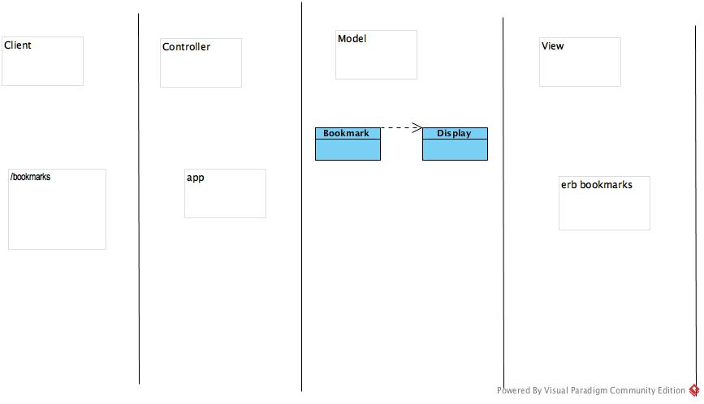

# Bookmark Manager Project

## A guide to setup the database from scratch:

1. Connect to `psql`
2. Create the database using the `psql` command `CREATE DATABASE bookmark_manager;`
3. Connect to the database using the `pqsl` command `\c bookmark_manager;`
4. Run the query we have saved in the file `01_create_bookmarks_table.sql`
5. Repeat for the test database 'test_bookmark_manager'

## User Stories

```
As a user,
So that I can get to my bookmarks
I want to see a list of my bookmarks
```

```
As a user,
So that I can remember new important sites
I want to be able to add new bookmarks
```

## Domain model diagrams



### A later domain model diagram:

     ┌──────┐          ┌──────────┐          ┌─────┐          ┌────────┐          ┌────┐
     │Client│          │Controller│          │Model│          │Database│          │View│
     └──┬───┘          └────┬─────┘          └──┬──┘          └───┬────┘          └─┬──┘
        │    get-request    │                   │                 │                 │   
        │ ──────────────────>                   │                 │                 │   
        │                   │                   │                 │                 │   
        │                   │       .all        │                 │                 │   
        │                   │ ─────────────────>│                 │                 │   
        │                   │                   │                 │                 │   
        │                   │                   │     query       │                 │   
        │                   │                   │────────────────>│                 │   
        │                   │                   │                 │                 │   
        │                   │                   │ result-object   │                 │   
        │                   │                   │<─ ─ ─ ─ ─ ─ ─ ─ │                 │   
        │                   │                   │                 │                 │   
        │                   │    [bookmarks]    │                 │                 │   
        │                   │ <─ ─ ─ ─ ─ ─ ─ ─ ─│                 │                 │   
        │                   │                   │                 │                 │   
        │                   │                   │  [bookmarks]    │                 │   
        │                   │ ──────────────────────────────────────────────────────>   
        │                   │                   │                 │                 │   
        │                   │                   │      html       │                 │   
        │                   │ <─ ─ ─ ─ ─ ─ ─ ─ ─ ─ ─ ─ ─ ─ ─ ─ ─ ─ ─ ─ ─ ─ ─ ─ ─ ─ ─    
        │                   │                   │                 │                 │   
        │      response     │                   │                 │                 │   
        │ <─ ─ ─ ─ ─ ─ ─ ─ ─                    │                 │                 │   
     ┌──┴───┐          ┌────┴─────┐          ┌──┴──┐          ┌───┴────┐          ┌─┴──┐
     │Client│          │Controller│          │Model│          │Database│          │View│
     └──────┘          └──────────┘          └─────┘          └────────┘          └────┘
